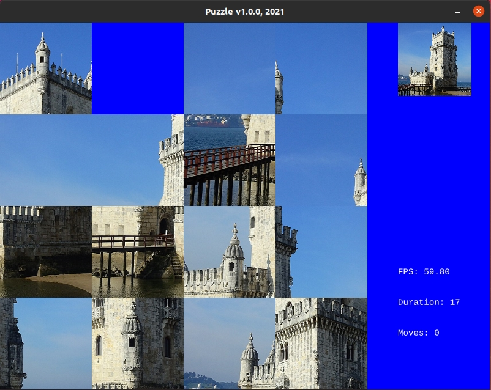

# Puzzle v1

## Description

A sliding puzzle, sliding block puzzle, or sliding tile puzzle is a combination puzzle that challenges a player to slide (frequently flat) pieces along certain routes (usually on a board) to establish a certain end-configuration. The pieces to be moved may consist of simple shapes, or they may be imprinted with colours, patterns, sections of a larger picture (like a jigsaw puzzle), numbers, or letters.



## Dependencies

* [Good Web Game](https://github.com/ggez/good-web-game)


## Build and run

```
cargo build --release

cargo run --release
```

## Author

* [Antonio Soares](https://github.com/ccie18473)

## License

This project is licensed under the [MIT] License - see the LICENSE.md file for details

